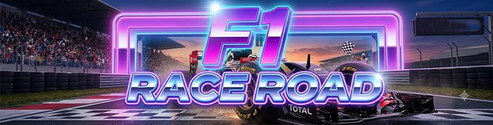

🏎️ F1 Race Road

A fast-paced, arcade-style racing game built in Python where you dodge oncoming F1 cars, react on instinct, and sharpen your reflexes and pattern-reading skills as the speed ramps up.

🎯 About the Game

F1 Race Road puts you behind the wheel on a busy racetrack full of rival F1 cars. Your only job: survive as long as possible by dodging traffic that comes at you in increasingly unpredictable patterns.

It's more than just a reflex game — as obstacles multiply and speed increases, you're forced to:


Anticipate where the next car will appear before it's fully on screen
Read patterns in how obstacles are spaced and timed
React quickly under pressure without panicking
Plan your lane changes a few moves ahead instead of just reacting to what's directly in front of you


This blend of quick reflexes and forward-thinking decision-making makes it a fun way to train focus, hand-eye coordination, and quick pattern recognition — all while enjoying some high-speed F1 action.

🕹️ Features


Smooth car movement across multiple lanes
Randomly generated traffic patterns that increase in difficulty over time
Score tracking based on survival time / distance
Simple, lightweight, and easy to run — no heavy dependencies


🛠️ Requirements


Python 3.x
Pygame (or whichever library the game uses)


Install dependencies with:

```bash
pip install pygame
```

🚀 How to Run


Clone the repository:


```bash
   git clone https://github.com/your-username/f1-race-road.git
   cd f1-race-road
```

Install the requirements:


```bash
   pip install -r requirements.txt
```

Run the game:


```bash
   python F1Race.py
```

🎮 Controls

| Key | Action |
|-----|--------|
| ⬅️ / A | Move left |
| ➡️ / D | Move right |
| Space | Pause / Restart |
| Esc | Quit |

🏁 Objective

Dodge as many F1 cars as you can without crashing. The longer you survive, the higher your score — and the sharper your reaction time and forward-thinking get!

🤝 Contributing

Contributions, ideas, and pull requests are welcome! Feel free to open an issue if you spot a bug or have a feature request.

📄 License

This project is open source and available under the MIT License.


Built with ❤️ and a need for speed 🏎️💨
